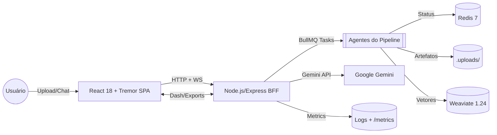

# Nexus QuantumI2A2 – Ecossistema de Inteligência Fiscal

Nexus QuantumI2A2 é um ecossistema de análise fiscal que combina processamento assíncrono de documentos, um pipeline multiagente e recursos de IA (Google Gemini) para transformar arquivos tributários brasileiros em dashboards interativos, simulações tributárias e relatórios exportáveis. Este README consolida o estado *atual e validado* do repositório para auditores, desenvolvedores e demais stakeholders.

---

## 1. Visão Geral

### Propósito e escopo
- Automatizar a leitura de arquivos fiscais heterogêneos (NF-e XML, PDF com OCR, CSV, DOCX, XLSX, ZIP) e gerar insights acionáveis.
- Fornecer um dashboard único para acompanhamento do pipeline, simulações tributárias, reconciliação bancária e chat com RAG contextual.
- Servir como camadas BFF + SPA para operar com segurança (chave Gemini apenas no backend), escalabilidade (BullMQ/Redis) e rastreabilidade (logs estruturados, métricas Prometheus).

### Capacidades principais
- Upload em lote com acompanhamento em tempo real via WebSockets.
- Pipeline de agentes: extração, validação, auditoria, classificação, análise (IA) e indexação para RAG.
- Dashboard modular (Tremor) com sumário executivo, tendências NF-e, simulador tributário e exportação (PDF, DOCX, HTML, SPED, EFD, CSV, ledger).
- Chat fiscal com RAG (Weaviate) e anexos adicionais, integrando ferramentas (`tax_simulation`, `cnpj_validation`).
- Serviços complementares: reconciliação bancária a partir de OFX/CSV, automação contábil e persistência local (`.uploads/`).

---

## 2. Arquitetura Validada

O projeto adota um **Frontend React + Vite (TypeScript)** acoplado a um **Backend-for-Frontend em Node.js/Express**. A orquestração de jobs é feita via BullMQ + Redis; vetores são armazenados no Weaviate para o chat RAG; o pipeline IA usa Google Gemini via `@google/genai`.



### Componentes e artefatos

| Domínio | Descrição | Artefatos-chave |
| --- | --- | --- |
| Frontend SPA | React 18.3 + Vite 6.4, componentes Tremor, Tailwind (CDN). Carrega `App.tsx`, memória cognitiva em `contexts/` e serviços em `services/`. | `App.tsx`, `components/`, `services/*.ts`, `config.ts`, `contexts/` |
| Backend BFF | Express + WebSocket Server; rotas em `backend/routes`; pipeline multiagente em `backend/agents`; storage local e ferramentas Gemini. | `backend/server.js`, `backend/routes/`, `backend/agents/`, `backend/services/` |
| Infraestrutura | Redis para estado/cache, Weaviate para RAG, BullMQ workers, Docker Compose para dev. | `docker-compose.yml`, `.uploads/`, `weaviate_data/`, `backend/services/queue.js` |
| CI / Automação | GitHub Actions `ci.yml` executa `npm ci`, testes backend e `npm run build`. Script `start-dev.sh` levanta todo o stack localmente. | `.github/workflows/ci.yml`, `start-dev.sh` |

---

## 3. Fluxos e Agentes

### Pipeline backend (definido em `backend/pipeline.yaml`)

| Ordem | Agente | Responsabilidades principais | Saídas relevantes |
| --- | --- | --- | --- |
| 1 | `extractionAgent` | Descompacta, converte e normaliza arquivos via `services/extractor.js`; extrai entidades e chunks. | Artefatos textuais + metadados para Redis/Weaviate |
| 2 | `validationAgent` | Regras de consistência e enriquecimento (CNPJ, CFOP, valores). | Alertas/validações em `job.pipeline[1]` |
| 3 | `auditAgent` | Auditoria simulada e classificação preliminar de risco. | Findings para dashboards |
| 4 | `classificationAgent` | Tagging (tipo de operação/setor) e preparação para simulação. | Estrutura para IA e exportações |
| 5 | `analysisAgent` | Orquestra prompts Gemini, chama ferramentas (`tax_simulation`, `cnpj_validation`), gera `executiveSummary`. | Relatório executivo JSON |
| 6 | `indexingAgent` | Vetoriza chunks e persiste no Weaviate (`DocumentChunk`). | Base RAG para chat/contexto |

Eventos (`eventBus`) acionam filas BullMQ (`backend/services/queue.js`). O estado de cada job fica em `redisClient` (`job:{id}`), exibido via WebSocket (`ws://.../ ?jobId=`). Arquivos persistem em `.uploads/objects` via `storageService`.

### Frontend e fluxos de experiência
- **Upload & Tracking:** `FileUpload.tsx` envia `FormData` para `/api/jobs`. `PipelineTracker.tsx` reflete `job.pipeline`.
- **Dashboard modular:** `components/dashboard/*.tsx` apresentam métricas, insights CSV, simulações (`TaxSimulator`), comparativos e chat (`InteractiveChat.tsx`).
- **Memória cognitiva local:** `services/contextMemory.ts` guarda índices, caches de Q&A, forecast, correções de classificação e feedbacks.
- **Exportação client-side:** `services/exportService.ts` captura DOM e gera PDF/DOCX/HTML com jsPDF, docx e html2canvas.

### Integrações e serviços auxiliares
- **Chat RAG (`POST /api/jobs/:id/chat`):** combina Weaviate, contexto estruturado do job e anexos adicionais (processados por `extractArtifactsFromMetas`). Cacheado em Redis.
- **Exportações fiscais (`POST /api/jobs/:id/exports`):** gera SPED, EFD, CSV ERP e ledger contábil via `services/exporter.js`.
- **Conciliação bancária (`POST /api/jobs/:id/reconciliation`):** processa OFX/CSV em `services/reconciliation.js`.
- **Observabilidade:** logs (Pino-like) em `services/logger`, métricas Prometheus-like expostas em `/metrics`.

---

## 4. Tecnologias & Dependências Open Source

### Frontend

| Tecnologia | Versão | Uso |
| --- | --- | --- |
| React | 18.3.1 | SPA, hooks e ecossistema. |
| Vite | 6.4.1 | Dev server/build. |
| TypeScript | 5.8.3 | Tipagem estática. |
| Tremor React | 3.18.7 | Dashboards/gráficos. |
| Tailwind CSS | 3.x (CDN) | Estilização utility-first. |
| @google/genai | 1.29.0 | Cliente Gemini no browser (proxy via BFF). |
| jsPDF / docx / html2canvas | 2.5.1 / 8.5.0 / 1.4.1 | Exportação de relatórios. |
| tesseract.js, pdfjs-dist, PapaParse, xml-js, jszip | 5.1.0 / 4.3.136 / 5.4.1 / 1.6.11 / 3.10.1 | Parsing/OCR/ZIP local. |

### Backend

| Tecnologia | Versão | Uso |
| --- | --- | --- |
| Node.js (recomendado ≥18) | — | Runtime. |
| Express | 4.21.2 | API HTTP/WS BFF. |
| ws | 8.18.3 | WebSocket server. |
| BullMQ | 5.63.0 | Filas/Workers. |
| redis (cliente) | 4.7.1 | Estado de jobs/cache. |
| @google/genai | 1.29.0 | Chamadas Gemini server-side. |
| @langchain/core | 0.3.79 | Cadeias LangChain customizadas. |
| @langchain/google-genai | 0.1.12 | LLM e embeddings Gemini via LangChain. |
| weaviate-ts-client | 2.2.0 | CRUD de vetores RAG. |
| multer, uuid, joi | 1.4.5-lts.2 / 9.0.1 / 17.13.3 | Upload, IDs e validação. |
| pdf-parse, mammoth, xlsx, csv-parse | 2.4.5 / 1.11.0 / 0.18.5 / 5.6.0 | Extração de artefatos server-side. |

### Infraestrutura

| Serviço | Versão | Papel |
| --- | --- | --- |
| Redis | 7-alpine (Docker) | Cache e filas BullMQ. |
| Weaviate | 1.24.1 | Banco vetorial para RAG. |
| Docker / Docker Compose | ≥20.x / v2 | Provisiona Redis + Weaviate localmente. |

Lista completa no arquivo `DEPENDENCIES.md`.

---

## 5. Requisitos e Configuração de Ambiente

### Pré-requisitos
1. Node.js 18 LTS (ou superior) + npm.
2. Docker e Docker Compose (para Redis/Weaviate).
3. Chave válida da API Google Gemini (`GEMINI_API_KEY`).
4. Espaço local para `.uploads/` e `weaviate_data/`.

### Variáveis de ambiente (arquivo `backend/.env`)
```env
PORT=3001
GEMINI_API_KEY=seu-token
GEMINI_MODEL_ID=gemini-2.5-flash
GEMINI_EMBEDDING_MODEL_ID=text-embedding-004
REDIS_URL=redis://localhost:6379
UPLOAD_MAX_FILE_SIZE_MB=200
UPLOAD_MAX_FILES=20
CHAT_MAX_ATTACHMENTS=5
UPLOAD_CACHE_DIR=.uploads/cache
UPLOAD_RETENTION_HOURS=24
UPLOAD_CLEANUP_INTERVAL_MINUTES=60
UPLOAD_ENCRYPTION_KEY=troque-por-uma-chave-segura
DATA_GOVERNANCE_MASKING=true
WEAVIATE_SCHEME=http
WEAVIATE_HOST=localhost:8080
WEAVIATE_API_KEY=dev-weaviate-key
```
Outras flags opcionais: `UPLOAD_TMP_DIR`, `CHAT_ATTACHMENT_SNIPPET_LENGTH`, `GEMINI_MAX_RETRIES`, etc. O frontend lê `VITE_BFF_API_URL`/`VITE_BFF_PORT` quando necessário.

### Variáveis de ambiente (frontend)
```env
VITE_CHAT_MAX_RAG_SNIPPETS=6
VITE_CHAT_RAG_SNIPPET_LENGTH=600
VITE_CHAT_ATTACHMENT_SNIPPET_LENGTH=800
VITE_CHAT_FALLBACK_FILE_LIMIT=3
VITE_CHAT_FALLBACK_CHAR_BUDGET=12000
```

---

## 6. Instalação e Execução

### Inicialização automatizada (recomendado)
```bash
chmod +x start-dev.sh
./start-dev.sh
```
O script instala dependências, sobe Redis/Weaviate via Docker, valida saúde dos serviços, inicia `backend/server.js` (porta 3001) e o Vite Dev Server (porta 8000). Logs do backend ficam em `backend.log`.

### Procedimento manual
```bash
# 1. Instalar dependências
npm install
npm --prefix backend install

# 2. Provisionar serviços de apoio
docker compose up -d   # Redis + Weaviate

# 3. Configurar variáveis em backend/.env

# 4. Executar backend
NODE_ENV=development node backend/server.js

# 5. Executar frontend em outra aba
npm run dev -- --port 8000
```
Após o build, o frontend pode ser servido com `npm run build && npm run preview`.

---

## 7. Testes, Qualidade e Observabilidade

- **Testes backend:** `GEMINI_API_KEY=test npm --prefix backend test`. (Utiliza Jest + Supertest; sockets podem exigir ambiente não restrito.)
- **Lint:** `npm --prefix backend run lint` (ESLint 8.57). Frontend utiliza o conjunto padrão do Vite/TS.
- **Build frontend:** `npm run build`.
- **CI:** `.github/workflows/ci.yml` executa os passos acima em pushes/PRs para `main` e `teste`.
- **Métricas:** `GET /metrics` retorna snapshot JSON ou, com `Accept: text/plain`, formato Prometheus (`http_requests_total`, `ws_connections_active`, `analysis_prompt_tokens`, etc.).
- **Health-check:** `GET /api/health` valida Redis, Weaviate e chave Gemini.
- **Logs:** `services/logger` (Pino) registra requisições HTTP, eventos de agentes e falhas.

---

## 8. Operações e Integrações

- **Upload e acompanhamento:** `POST /api/jobs` (multipart com até 20 arquivos, 50 MB cada) inicia job; o ID retornado é usado no WebSocket `ws://host:3001?jobId=...`.
- **Chat com anexos:** `POST /api/jobs/:jobId/chat` aceita JSON (`{ question }`) ou `multipart/form-data` (campo `attachments`). As respostas podem disparar ferramentas internas antes de retornar ao usuário.
- **Exportações fiscais:** `POST /api/jobs/:jobId/exports` com `{ "format": "sped" | "efd" | "csv" | "ledger" }` retorna payload base64 acompanhado de log/diagnóstico.
- **Conciliação bancária:** `POST /api/jobs/:jobId/reconciliation` recebe OFX/CSV, cruza com NF-es processadas e devolve `matches`, `pendingInvoices` e `pendingTransactions`.
- **Observabilidade Web:** `PipelineTracker`, `ErrorLogModal` e logs persistidos via `useErrorLog` facilitam auditoria visual.
- **Gestão de armazenamento:** Arquivos em `.uploads/objects` e caches de artefatos são deduplicados por hash e limpos automaticamente após o intervalo definido pelas variáveis `UPLOAD_RETENTION_HOURS` / `UPLOAD_CLEANUP_INTERVAL_MINUTES`.
- **Segurança vetorial:** o Weaviate local exige `WEAVIATE_API_KEY` e pode ser apontado para hosts/URIs customizados via `WEAVIATE_HOST` / `WEAVIATE_SCHEME`.
- **Governança de dados:** para ambientes que demandem mascaramento e criptografia, habilite `DATA_GOVERNANCE_MASKING=true` e defina `UPLOAD_ENCRYPTION_KEY` (AES-256-GCM) para garantir confidencialidade dos arquivos em repouso.

---

## 9. Política de Contribuição e Manutenção

1. **Discussões e issues:** Registre problemas/novos recursos detalhando cenários fiscais e formatos de arquivo afetados.
2. **Branches & PRs:** Trabalhe em branches dedicadas; abra PR para `main` descrevendo mudanças e impacto fiscal/operacional.
3. **Testes e validação:** Execute `npm --prefix backend test` e `npm run build` antes do PR. Inclua novos testes para agentes/pipelines alterados.
4. **Documentação:** Atualize `README.md`, `DEPENDENCIES.md` e, quando aplicável, `pipeline.yaml`/diagramas sempre que mudar fluxos.
5. **Segurança:** Nunca commitar chaves Gemini ou dumps fiscais. Utilize `.env` e secrets do GitHub Actions.

Manutenção contínua inclui rodar `docker compose down` para limpar ambiente, revisar `backend.log`, e monitorar `weaviate_data/` para backups.

---

## 10. Licenciamento

O projeto é distribuído sob a **MIT License** (`LICENSE`). Qualquer contribuição aceita herda o mesmo licenciamento.

---

## 11. Estado atual e riscos conhecidos
- **Segurança de Armazenamento:** A pasta `.uploads/` guarda arquivos sensíveis. Em um ambiente de produção, é crucial garantir o isolamento de disco e políticas de retenção adequadas. A criptografia em repouso pode ser ativada via variáveis de ambiente.
- A pasta `.uploads/` guarda arquivos sensíveis sem criptografia. Garanta isolamento de disco e políticas de retenção ao rodar em produção.
- Testes que dependem de sockets podem falhar em ambientes restritos (e.g., Codespaces) por bloqueio de portas; utilize runners locais/CI.

Para detalhes complementares, consulte:
- `backend/agents/*.js` — lógica de cada agente.
- `backend/services/*.js` — integrações (Gemini, Redis, Weaviate, exportação, reconciliação).
- `components/dashboard/` — módulos visuais.
- `DEPENDENCIES.md` — catálogo completo de bibliotecas.

---

Este README reflete o estado verificado em `/workspaces/NexusQuantumI2A2-ProjetoFinal`, fornecendo um ponto único de referência técnica para novas auditorias e evolução da plataforma.
